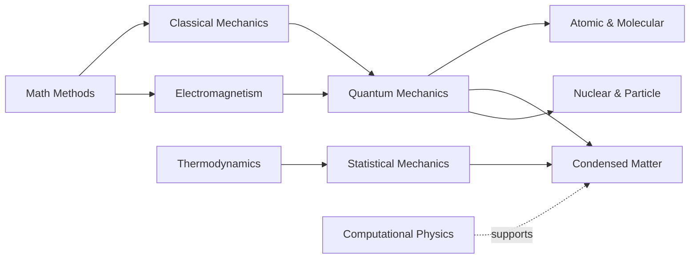

# 🗺️ Undergraduate Physics Study Roadmap

A suggested sequence mapping core subjects across a typical 6-semester B.Sc. (adapt for B.Tech).

## Suggested semester map

| Semester | Core focus | Math support |
|---|---|---|
| Sem 1 | Classical Mechanics | Calculus, Vectors |
| Sem 2 | Electromagnetism I, Waves & Optics | Differential Equations |
| Sem 3 | Thermodynamics, Electronics | Linear Algebra |
| Sem 4 | Quantum Mechanics I, EM II | Complex analysis, Fourier |
| Sem 5 | Statistical Mechanics, Atomic & Molecular | Mathematical Methods |
| Sem 6 | Solid State / Condensed Matter, Nuclear & Particle | Computational Physics |

## Dependency flow

## Tips
- Build a strong **math methods** base early; it unlocks everything else.
- Pair every theory course with a **problem set** habit.
- Start light **Python / computational** work by Sem 3 — see [tools](tools/software-and-simulation.md).
